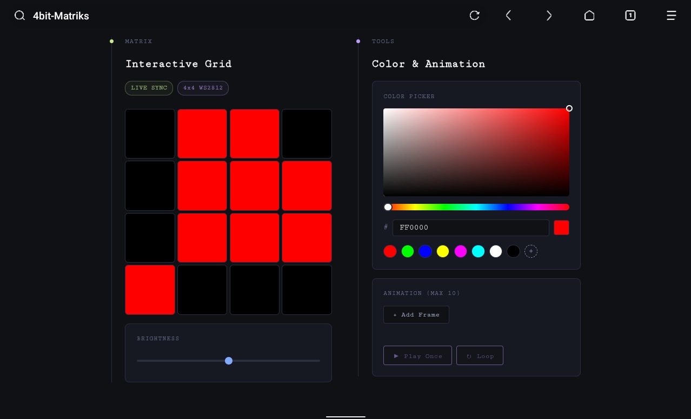
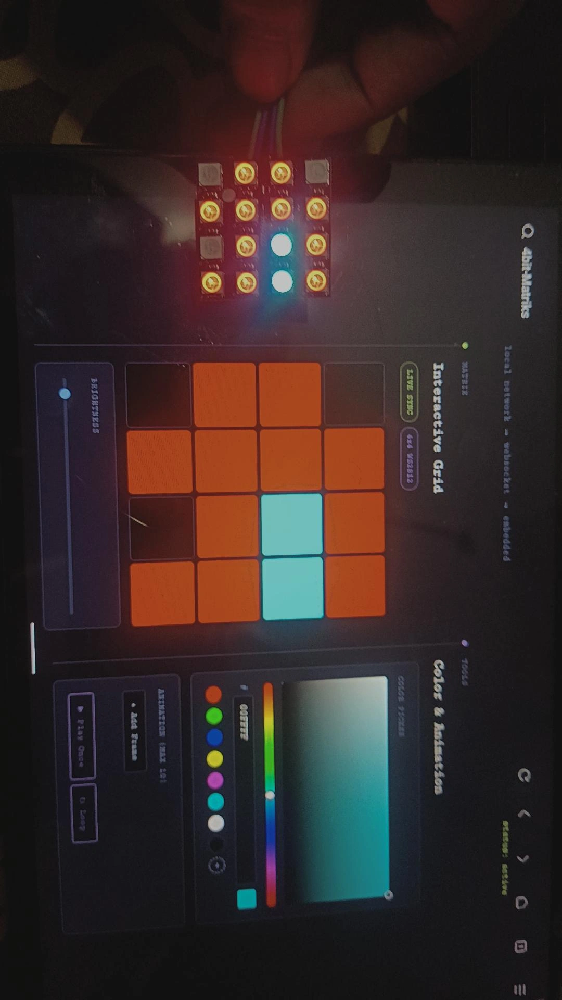
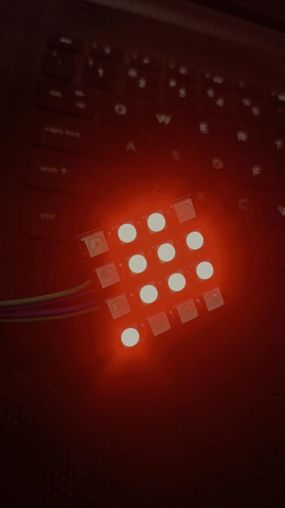

# 4bit-Matriks

> A tiny ESP32-powered 4×4 RGB pixel-art display with a real-time web editor and animations.



## Overview

4bit-Matriks is a Wi-Fi controlled 4×4 WS2812 RGB matrix powered by an ESP32.

The ESP32 creates its own local Wi-Fi network and serves a browser-based pixel editor. Changes made in the web interface are sent to the matrix in real time over WebSocket.

No internet connection is required.

## Demo



The web editor and physical matrix stay synchronized in real time.

## Features

- 🎨 Interactive 4×4 pixel editor
- 📡 Real-time WebSocket control
- 🌈 Custom color picker and presets
- ☀️ Live brightness adjustment
- 🎞️ Frame-by-frame animations
- 🔁 Play once and loop modes
- 📱 Responsive phone, tablet, and desktop UI
- 🛜 Runs entirely on the ESP32's local network
- 🚫 No external libraries or internet required by the web interface

## Hardware



- ESP32
- 4×4 WS2812 RGB LED matrix
- Breadboard
- Jumper wires
- 5V power supply

## Wiring

| Matrix Pin | Connects To |
|---|---|
| `VCC` | Breadboard `5V (+)` |
| `GND 1` | Breadboard `GND (-)` |
| `IN` | ESP32 `GPIO 20` |
| `GND 2` | ESP32 `GND` |

> The ESP32 and LED matrix must share a common ground.

## How It Works

```text
Web Editor
    │
    │ WebSocket
    ▼
ESP32 Access Point
    │
    │ GPIO 20
    ▼
4×4 WS2812 Matrix
